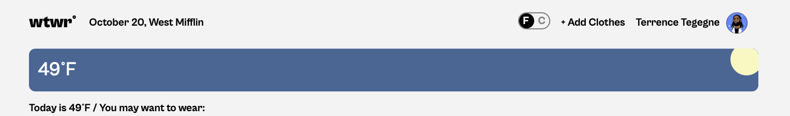
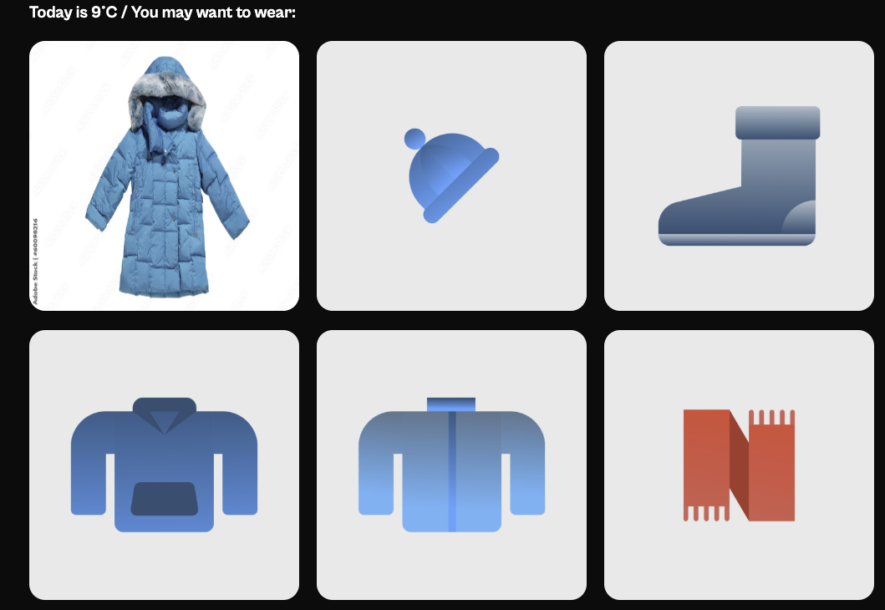

# Project: What to Wear React

## Description

The purpose of this project was to create an app that incorporated APIs and used the local weather to determine what to wear. Also, the app allows you to toggle between Celsius and Fahrenheit, and you can add your own garments and store them on the server for later use as well.

## Tech Stack

-HTML
-CSS
-JavaScript
-React
-Vite

## Screenshots

## Project Pitch Video

Check out [this video](https://drive.google.com/file/d/1KiaSPs9z9Pu2TC1DbZe6wy2H52WAaf1u/view?usp=drive_link), where I describe my
project and some challenges I faced while building it.
